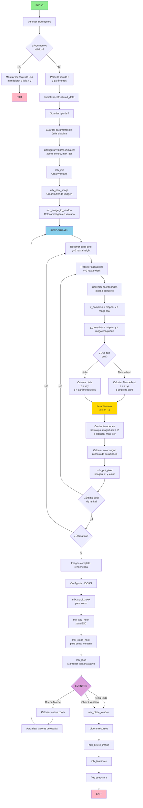

```mermaid
graph TD
    A[INICIO] --> B[Verificar argumentos]
    B --> C{¿Argumentos<br/>válidos?}
    C -->|NO| D[Mostrar mensaje de uso<br/>mandelbrot o julia x y]
    D --> E[EXIT]
    C -->|SÍ| F[Parsear tipo de f<br/>y parámetros]
    
    F --> G[Inicializar estructura t_data]
    G --> G1[Guardar tipo de f]
    G1 --> G2[Guardar parámetros de Julia si aplica]
    G2 --> G3[Configurar valores iniciales:<br/>zoom, centro, max_iter]
    
    G3 --> H[mlx_init<br/>Crear ventana]
    H --> I[mlx_new_image<br/>Crear buffer de imagen]
    I --> J[mlx_image_to_window<br/>Colocar imagen en ventana]
    
    J --> K[RENDERIZAR f]
    K --> L[Recorrer cada píxel<br/>y=0 hasta height]
    L --> M[Recorrer cada píxel<br/>x=0 hasta width]
    
    M --> N[Convertir coordenadas<br/>píxel a complejo]
    N --> N1[x_complejo = mapear x a rango real]
    N1 --> N2[y_complejo = mapear y a rango imaginario]
    
    N2 --> O{¿Qué tipo<br/>de f?}
    O -->|Mandelbrot| P[Calcular Mandelbrot<br/>c = x+yi<br/>z empieza en 0]
    O -->|Julia| Q[Calcular Julia<br/>z = x+yi<br/>c = parámetros fijos]
    
    P --> R[Iterar fórmula:<br/>z = z² + c]
    Q --> R
    
    R --> S[Contar iteraciones<br/>hasta que magnitud z > 2<br/>o alcanzar max_iter]
    
    S --> T[Calcular color según<br/>número de iteraciones]
    T --> U[mlx_put_pixel<br/>imagen, x, y, color]
    
    U --> V{¿Último píxel<br/>de la fila?}
    V -->|NO| M
    V -->|SÍ| W{¿Última fila?}
    W -->|NO| L
    W -->|SÍ| X[Imagen completa renderizada]
    
    X --> Y[Configurar HOOKS]
    Y --> Y1[mlx_scroll_hook<br/>para zoom]
    Y1 --> Y2[mlx_key_hook<br/>para ESC]
    Y2 --> Y3[mlx_close_hook<br/>para cerrar ventana]
    
    Y3 --> Z[mlx_loop<br/>Mantener ventana activa]
    
    Z --> AA{EVENTOS}
    
    AA -->|Rueda Mouse| AB[Calcular nuevo zoom]
    AB --> AC[Actualizar valores de escala]
    AC --> K
    
    AA -->|Tecla ESC| AD[mlx_close_window]
    AD --> AE[Liberar recursos]
    
    AA -->|Click X ventana| AD
    
    AE --> AF[mlx_delete_image]
    AF --> AG[mlx_terminate]
    AG --> AH[free estructura]
    AH --> AI[EXIT]
    
    style A fill:#90EE90
    style E fill:#FFB6C6
    style AI fill:#FFB6C6
    style K fill:#87CEEB
    style R fill:#FFD700
    style AA fill:#DDA0DD
```