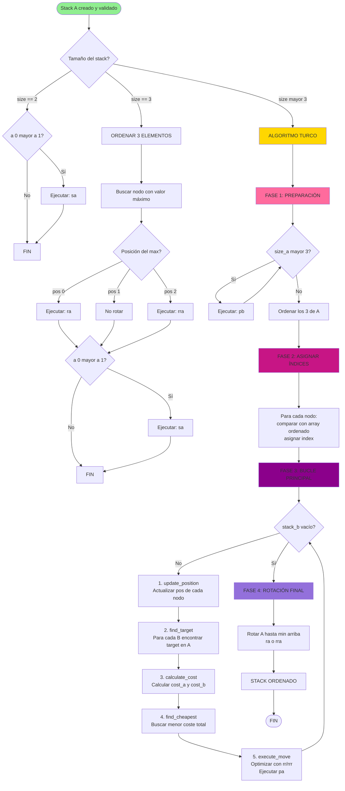

```mermaid
graph TD
    Start([Stack A creado y validado]) --> CheckSize{Tamaño del stack?}
    
    CheckSize -->|size == 2| Check2{a 0 mayor a 1?}
    Check2 -->|Sí| SA[Ejecutar: sa]
    Check2 -->|No| End2[Ya ordenado]
    SA --> End2[FIN]
    
    CheckSize -->|size == 3| Sort3Start[ORDENAR 3 ELEMENTOS]
    Sort3Start --> FindMax[Buscar nodo con valor máximo]
    FindMax --> MaxPos{Posición del max?}
    MaxPos -->|pos 0| RA[Ejecutar: ra]
    MaxPos -->|pos 1| DoNothing[No rotar]
    MaxPos -->|pos 2| RRA[Ejecutar: rra]
    RA --> CheckSwap3{a 0 mayor a 1?}
    DoNothing --> CheckSwap3
    RRA --> CheckSwap3
    CheckSwap3 -->|Sí| SA3[Ejecutar: sa]
    CheckSwap3 -->|No| End3[FIN]
    SA3 --> End3
    
    CheckSize -->|size mayor 3| Turkish[ALGORITMO TURCO]
    Turkish --> Phase1[FASE 1: PREPARACIÓN]
    Phase1 --> PushLoop{size_a mayor 3?}
    PushLoop -->|Sí| PB1[Ejecutar: pb]
    PB1 --> PushLoop
    PushLoop -->|No| Sort3inA[Ordenar los 3 de A]
    
    Sort3inA --> Phase2[FASE 2: ASIGNAR ÍNDICES]
    Phase2 --> AssignInfo[Para cada nodo:<br/>comparar con array ordenado<br/>asignar index]
    
    AssignInfo --> Phase3[FASE 3: BUCLE PRINCIPAL]
    Phase3 --> MainLoop{stack_b vacío?}
    MainLoop -->|No| UpdatePos[1. update_position<br/>Actualizar pos de cada nodo]
    UpdatePos --> FindTarget[2. find_target<br/>Para cada B encontrar target en A]
    FindTarget --> CalcCost[3. calculate_cost<br/>Calcular cost_a y cost_b]
    CalcCost --> FindCheap[4. find_cheapest<br/>Buscar menor coste total]
    FindCheap --> ExecMove[5. execute_move<br/>Optimizar con rr/rrr<br/>Ejecutar pa]
    ExecMove --> MainLoop
    
    MainLoop -->|Sí| Phase4[FASE 4: ROTACIÓN FINAL]
    Phase4 --> FinalRot[Rotar A hasta min arriba<br/>ra o rra]
    FinalRot --> Done[STACK ORDENADO]
    Done --> End([FIN])
    
    style Start fill:#90EE90
    style Turkish fill:#FFD700
    style Phase1 fill:#FF6B9D
    style Phase2 fill:#C71585
    style Phase3 fill:#8B008B
    style Phase4 fill:#9370DB
```