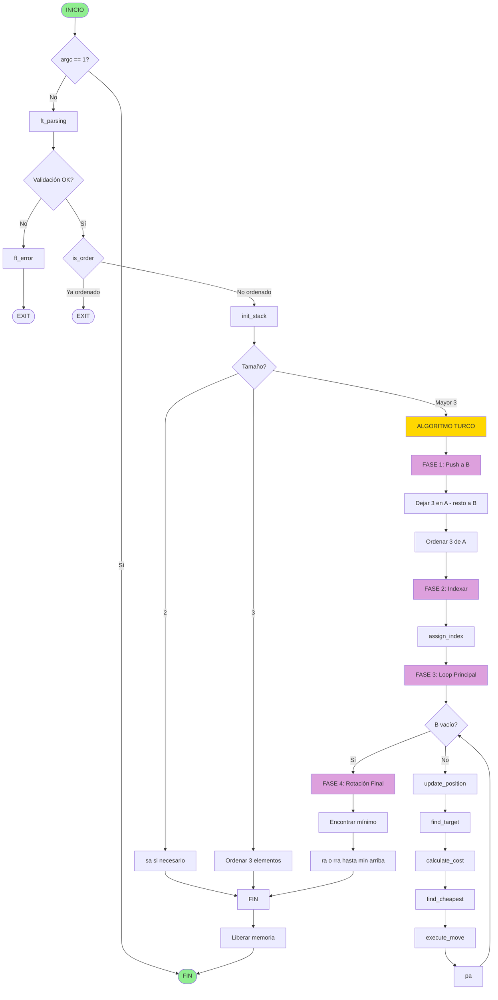

```mermaid
    graph TD
    Start([INICIO]) --> CheckArgs{argc == 1?}
    CheckArgs -->|Sí| End([FIN])
    CheckArgs -->|No| Parsing[ft_parsing]
    
    Parsing --> ValidArgs{Validación OK?}
    ValidArgs -->|No| Error[ft_error]
    Error --> Exit1([EXIT])
    ValidArgs -->|Sí| CheckOrder{is_order}
    CheckOrder -->|Ya ordenado| Exit0([EXIT])
    CheckOrder -->|No ordenado| InitStack[init_stack]
    
    InitStack --> CheckSize{Tamaño?}
    CheckSize -->|2| Sort2[sa si necesario]
    CheckSize -->|3| Sort3[Ordenar 3 elementos]
    CheckSize -->|Mayor 3| Turkish[ALGORITMO TURCO]
    
    Sort2 --> Done[FIN]
    Sort3 --> Done
    
    Turkish --> Fase1[FASE 1: Push a B]
    Fase1 --> PushB[Dejar 3 en A - resto a B]
    PushB --> Sort3A[Ordenar 3 de A]
    
    Sort3A --> Fase2[FASE 2: Indexar]
    Fase2 --> Assign[assign_index]
    
    Assign --> Fase3[FASE 3: Loop Principal]
    Fase3 --> LoopCheck{B vacío?}
    LoopCheck -->|No| UpdatePos[update_position]
    UpdatePos --> FindTarget[find_target]
    FindTarget --> CalcCost[calculate_cost]
    CalcCost --> Cheapest[find_cheapest]
    Cheapest --> Move[execute_move]
    Move --> Push[pa]
    Push --> LoopCheck
    
    LoopCheck -->|Sí| Fase4[FASE 4: Rotación Final]
    Fase4 --> FindMin[Encontrar mínimo]
    FindMin --> Rotate[ra o rra hasta min arriba]
    Rotate --> Done
    
    Done --> Free[Liberar memoria]
    Free --> End
    
    style Start fill:#90EE90
    style End fill:#90EE90
    style Turkish fill:#FFD700
    style Fase1 fill:#DDA0DD
    style Fase2 fill:#DDA0DD
    style Fase3 fill:#DDA0DD
    style Fase4 fill:#DDA0DD
```